# Alien: Isolation — Logros

**Plataforma:** Steam 
**Total de logros:** 50 · **Gamerscore total:** 1000
LOS LOGROS DE ESTE JUEGO SE DEBEN DEMOSTRAR CON CAPTURAS, LOS PUNTOS SE RECONTARAN AL FINAL DE CADA TRAMO DE LA LIGA. PASAD VUESTRAS CAPTURAS O VIDEOS AL TELEGRAM/DISCORD DEL EVENTO.

---

## Índice

- [Un intento](#un-intento)
- [Superviviente](#superviviente)
- [Ripley. Fin de la transmisión.](#ripley-fin-de-la-transmisión)
- [¿Piedad o prudencia?](#piedad-o-prudencia)
- [Fuera de alcance](#fuera-de-alcance)
- [Escóndete. Corre. Sobrevive.](#escóndete-corre-sobrevive)
- [Las voces de Sevastopol](#las-voces-de-sevastopol)
- [Para los archivos](#para-los-archivos)
- [Cautivos](#cautivos)
- [Es mi turno](#es-mi-turno)
- [Cóctel alienígena](#cóctel-alienígena)
- [Un verdadero ingeniero](#un-verdadero-ingeniero)
- [Ándate con ojo](#ándate-con-ojo)
- [Fallo detectado](#fallo-detectado)
- [Ni un rasguño](#ni-un-rasguño)
- [Admiro su pureza](#admiro-su-pureza)
- [Está en los conductos…](#está-en-los-conductos)
- [She's in the Vents…](#shes-in-the-vents)
- [Una solución sintética](#una-solución-sintética)
- [Consulta](#consulta)
- [El interruptor](#el-interruptor)
- [El mensaje](#el-mensaje)
- [Contención de riesgos](#contención-de-riesgos)
- [Transmisión](#transmisión)
- [Libera la Torrens](#libera-la-torrens)
- [El fin de la caza](#el-fin-de-la-caza)
- [Bienvenido a Sevastopol](#bienvenido-a-sevastopol)
- [Testigos del desastre](#testigos-del-desastre)
- [Tratamiento de choque](#tratamiento-de-choque)
- [Los desaparecidos](#los-desaparecidos)
- [¡Que ardan!](#que-ardan)
- [Juegos de poder](#juegos-de-poder)
- [Usar con cautela…](#usar-con-cautela)
- [Cada bala cuenta](#cada-bala-cuenta)
- [Experto en sistemas Seegson](#experto-en-sistemas-seegson)
- [Pirateo de seguridad de Seegson](#pirateo-de-seguridad-de-seegson)
- [En defensa propia](#en-defensa-propia)
- [A ver si funciona](#a-ver-si-funciona)
- [Un perfecto organismo](#un-perfecto-organismo)
- [¡Atrás!](#atrás)
- [Aturdido](#aturdido)
- [No es la primera](#no-es-la-primera)
- [Un hito del progreso](#un-hito-del-progreso)
- [En la trampa](#en-la-trampa)
- [¿Cómo te sientes?](#cómo-te-sientes)
- [Despierta](#despierta)
- [Comienza la caza](#comienza-la-caza)
- [No debería estar ahí](#no-debería-estar-ahí)
- [100 veces son pocas](#100-veces-son-pocas)
- [Fabrica y sobrevive](#fabrica-y-sobrevive)

---

### Un intento

**Descripción:** Completa el juego sin morir.  
**Gamerscore:** 100

[⬆ Volver al índice](#índice)

---

### Superviviente

**Descripción:** Completa el juego en la dificultad más elevada.  
**Gamerscore:** 100

[⬆ Volver al índice](#índice)

---

### Ripley. Fin de la transmisión.

**Descripción:** Completa el juego en cualquier dificultad.  
**Gamerscore:** 50

[⬆ Volver al índice](#índice)

---

### ¿Piedad o prudencia?

**Descripción:** Completa el juego sin matar a humanos.  
**Gamerscore:** 50

[⬆ Volver al índice](#índice)

---

### Fuera de alcance

**Descripción:** Contacta con tus compañeros y escapa de Comunicaciones sin que te ataque un solo androide.  
**Gamerscore:** 40

[⬆ Volver al índice](#índice)

---

### Escóndete. Corre. Sobrevive.

**Descripción:** Completa “La cuarentena” sin que te mate el alien.  
**Gamerscore:** 40

[⬆ Volver al índice](#índice)

---

### Las voces de Sevastopol

**Descripción:** Consigue 100 registros de archivos.  
**Gamerscore:** 40

[⬆ Volver al índice](#índice)

---

### Para los archivos
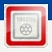
**Descripción:** Consigue todos los registros de la Nostromo.  
**Gamerscore:** 40

[⬆ Volver al índice](#índice)

---

### Cautivos
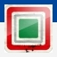
**Descripción:** Consigue todas las placas identificativas.  
**Gamerscore:** 40

[⬆ Volver al índice](#índice)

---

### Es mi turno

**Descripción:** Mata a un androide utilizando solo la herramienta de mantenimiento.  
**Gamerscore:** 40

[⬆ Volver al índice](#índice)

---

### Cóctel alienígena

**Descripción:** Repele al alien usando un molotov.  
**Gamerscore:** 20

[⬆ Volver al índice](#índice)

---

### Un verdadero ingeniero
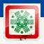
**Descripción:** Fabrica todos los objetos posibles.  
**Gamerscore:** 20

[⬆ Volver al índice](#índice)

---

### Ándate con ojo

**Descripción:** Ve por Mantenimiento del reactor sin morir.  
**Gamerscore:** 20

[⬆ Volver al índice](#índice)

---

### Fallo detectado
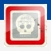
**Descripción:** Mata a un androide.  
**Gamerscore:** 20

[⬆ Volver al índice](#índice)

---

### Ni un rasguño
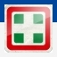
**Descripción:** Escapa del ataque de un androide sin recibir daños.  
**Gamerscore:** 20

[⬆ Volver al índice](#índice)

---

### Admiro su pureza
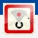
**Descripción:** Detecta 30 objetivos con el sensor de movimiento.  
**Gamerscore:** 20

[⬆ Volver al índice](#índice)

---

### Está en los conductos…

**Descripción:** Usa el sistema de ventilación 20 veces.  
**Gamerscore:** 20

[⬆ Volver al índice](#índice)

---

### She's in the Vents…

**Descripción:** (Variante en inglés; equivalente al anterior).  
**Gamerscore:** 20

[⬆ Volver al índice](#índice)

---

### Una solución sintética
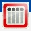
**Descripción:** Completa la duodécima misión.  
**Gamerscore:** 10

[⬆ Volver al índice](#índice)

---

### Consulta

**Descripción:** Completa la decimotercera misión.  
**Gamerscore:** 10

[⬆ Volver al índice](#índice)

---

### El interruptor
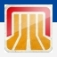
**Descripción:** Completa la decimocuarta misión.  
**Gamerscore:** 10

[⬆ Volver al índice](#índice)

---

### El mensaje

**Descripción:** Completa la decimoquinta misión.  
**Gamerscore:** 10

[⬆ Volver al índice](#índice)

---

### Contención de riesgos
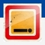
**Descripción:** Completa la undécima misión.  
**Gamerscore:** 10

[⬆ Volver al índice](#índice)

---

### Transmisión

**Descripción:** Completa la decimosexta misión.  
**Gamerscore:** 10

[⬆ Volver al índice](#índice)

---

### Libera la Torrens

**Descripción:** Completa la decimoséptima misión.  
**Gamerscore:** 10

[⬆ Volver al índice](#índice)

---

### El fin de la caza

**Descripción:** Completa la decimoctava misión.  
**Gamerscore:** 10

[⬆ Volver al índice](#índice)

---

### Bienvenido a Sevastopol

**Descripción:** Completa la primera misión.  
**Gamerscore:** 10

[⬆ Volver al índice](#índice)

---

### Testigos del desastre
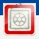
**Descripción:** Consigue un registro de archivo.  
**Gamerscore:** 10

[⬆ Volver al índice](#índice)

---

### Tratamiento de choque

**Descripción:** Usa la porra eléctrica.  
**Gamerscore:** 10

[⬆ Volver al índice](#índice)

---

### Los desaparecidos
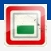
**Descripción:** Consigue una placa identificativa.  
**Gamerscore:** 10

[⬆ Volver al índice](#índice)

---

### ¡Que ardan!

**Descripción:** Usa el lanzallamas.  
**Gamerscore:** 10

[⬆ Volver al índice](#índice)

---

### Juegos de poder
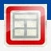
**Descripción:** Accede a 10 sistemas de reprogramación diferentes.  
**Gamerscore:** 10

[⬆ Volver al índice](#índice)

---

### Usar con cautela…
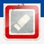
**Descripción:** Usa la escopeta.  
**Gamerscore:** 10

[⬆ Volver al índice](#índice)

---

### Cada bala cuenta
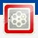
**Descripción:** Usa el revólver.  
**Gamerscore:** 10

[⬆ Volver al índice](#índice)

---

### Experto en sistemas Seegson

**Descripción:** Completa 10 minijuegos.  
**Gamerscore:** 10

[⬆ Volver al índice](#índice)

---

### Pirateo de seguridad de Seegson
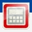
**Descripción:** Piratea 10 veces.  
**Gamerscore:** 10

[⬆ Volver al índice](#índice)

---

### En defensa propia
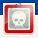
**Descripción:** Mata a diez humanos.  
**Gamerscore:** 10

[⬆ Volver al índice](#índice)

---

### A ver si funciona

**Descripción:** Usa el arma magnética / derrota varios androides con ella.  
**Gamerscore:** 10

[⬆ Volver al índice](#índice)

---

### Un perfecto organismo
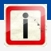
**Descripción:** Te has encontrado con el alien en Sevastopol por primera vez.  
**Gamerscore:** 10

[⬆ Volver al índice](#índice)

---

### ¡Atrás!

**Descripción:** Haz retroceder al alien usando el lanzallamas.  
**Gamerscore:** 10

[⬆ Volver al índice](#índice)

---

### Aturdido

**Descripción:** Derriba a un humano o aturde a un androide con un ataque contundente.  
**Gamerscore:** 10

[⬆ Volver al índice](#índice)

---

### No es la primera

**Descripción:** Desactiva la baliza.  
**Gamerscore:** 10

[⬆ Volver al índice](#índice)

---

### Un hito del progreso
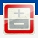
**Descripción:** Completa la séptima misión.  
**Gamerscore:** 10

[⬆ Volver al índice](#índice)

---

### En la trampa

**Descripción:** Completa “El brote” (sexta misión).  
**Gamerscore:** 10

[⬆ Volver al índice](#índice)

---

### ¿Cómo te sientes?
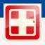
**Descripción:** Completa “La cuarentena” (quinta misión).  
**Gamerscore:** 10

[⬆ Volver al índice](#índice)

---

### Despierta

**Descripción:** Completa “Pasando página”.  
**Gamerscore:** 10

[⬆ Volver al índice](#índice)

---

### Comienza la caza
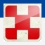
**Descripción:** Completa “Encuentros”.  
**Gamerscore:** 10

[⬆ Volver al índice](#índice)

---

### No debería estar ahí
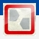
**Descripción:** Completa “Seegson Communications”.  
**Gamerscore:** 10

[⬆ Volver al índice](#índice)

---

### 100 veces son pocas
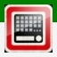
**Descripción:** Muere a manos del alien 100 veces.  
**Gamerscore:** 5

[⬆ Volver al índice](#índice)

---

### Fabrica y sobrevive

**Descripción:** Fabrica un objeto.  
**Gamerscore:** 5

[⬆ Volver al índice](#índice)
